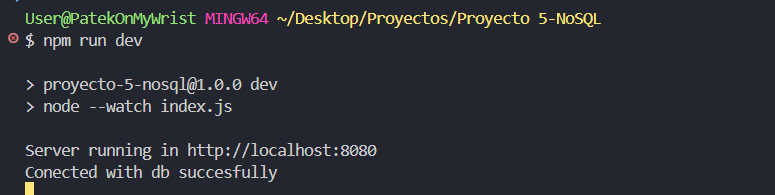
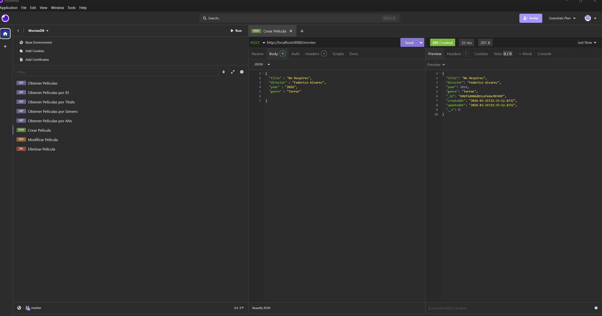
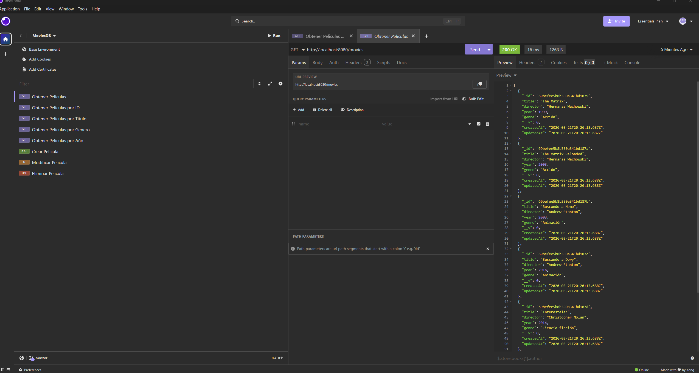
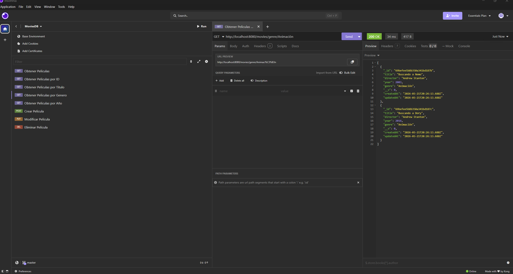
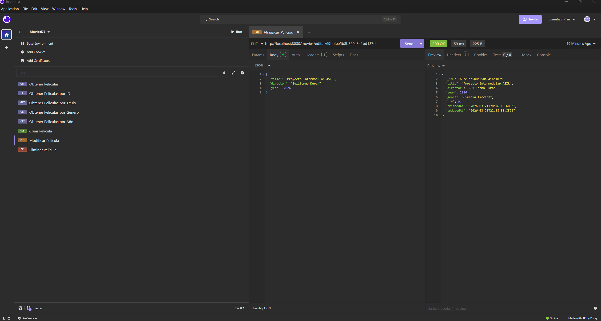
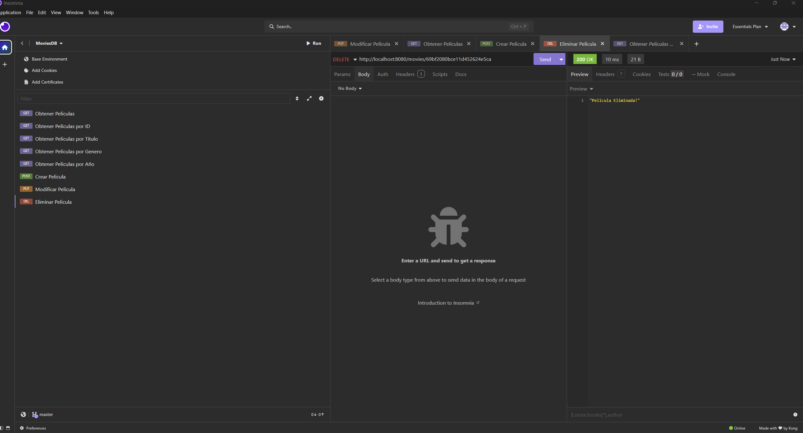
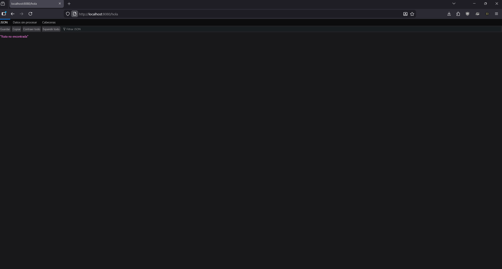

##  Arranque del Proyecto

##  Pruebas de los Endpoints (Insomnia)

### 1. Crear Película (POST)

### 2. Obtener Películas (GET)

### 2.1 Obtener Películas por ID (GET)

### 2.2 Obtener Películas por Titulo (GET)

### 2.3 Obtener Películas por Genero (GET)

### 2.4 Obtener Películas por Año (GET)

### 3. Modificar Película (PUT)

### 4. Eliminar Película (DELETE)

### 5. Control de Errores (404)

